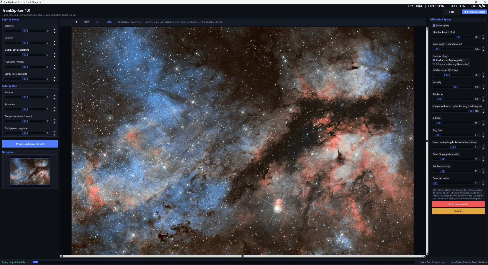

# frankSpikes

A Python GUI script for [Siril](https://siril.org/) that adds light/tone/color
adjustments and realistic diffraction spikes to a single astrophotography
image, with a live full-resolution preview — right inside Siril.

## Features

### Light & Tones
- **Exposure** — brightens/darkens the whole image
- **Contrast** — separates the subject from the background
- **Blacks / Sky Background** — sets how deep the sky/background is
- **Highlights / Whites** — protects the brightest areas from burning, or pushes them brighter
- **Clarity** — local (mid-tone) contrast on a large-radius unsharp mask, brings out nebula structure without touching global contrast

### Color & Hue
- **Vibrance** — boosts weaker colors more than already-saturated ones (protects reds like Hα from clipping), unlike a flat Saturation boost
- **Saturation** — makes all colors more or less vivid, uniformly
- **Temperature** — blue/yellow color balance
- **Tint** — green/magenta color balance (handy for removing the greenish light-pollution cast)

### Diffraction Spikes
Realistic star spikes as produced by a reflector's secondary-mirror spider:

- **4 or 6 rays** — 2-vane/refractor spider vs. 3-vane spider (e.g. most Newtonians)
- **Simple mode** (default) — one flat set of sliders (length, intensity, thickness, soft flare, ring flare, color fringing, rainbow, color saturation) covers every star in the image. Each slider's real-world effect still scales smoothly with each star's own size — essentially no effect right at the "Minimum star diameter" slider, the full dialled-in value from about 4x that diameter up — so a field of countless faint pinpoints and a handful of bright giants still look as different as they do in a real photo, from one set of controls. Stars smaller than the minimum get no spike at all
- **Per size mode** — the more advanced alternative: separate **Small / Medium / Large stars** tabs, each with the full set of controls tuned independently, blending smoothly between the three (not a hard cutoff) for finer control than Simple's one-knob-per-parameter scaling. The Small tab's own diameter doubles as the minimum-diameter cutoff. Switching from Simple to Per size carries the current look over onto the three tabs instead of resetting them, so you have a matching starting point to fine-tune from
- **Calibrated to your image** — right after detecting stars, the Small/Medium/Large (or Simple's Minimum diameter) sliders are automatically positioned from *this image's own* detected star sizes (5th/50th/90th percentile of the real field), not a one-size-fits-all guess — what counts as a "Large" star is set per picture, not hardcoded
- **Natural variation** — a small, deterministic per-star jitter on each spike's length and rotation (seeded by the star's own position) that breaks up the "stamped" look of many similar-size stars all rendering an identical spike
- Brightness also follows the star's own amplitude on top of its size, with each spike taking on **its own star's real color** (sampled from the star's own core pixels) rather than a flat white glow
- **Soft flare tail** — a per-size/per-star slider that adds a long power-law tail to the Soft flare glow (0 = the original gaussian-only glow, unchanged)
- **Physical spikes (beta)** — a second, physics-based layer that is *added on top of* the classic spikes (screen blend), so you can mix both or compare them on the same photo. It is off by default; with it off and the tail at 0 the result is identical to 2.0. It models the aperture instead of drawing an artistic ray:
  - **Aperture** — 4-vane or 3-vane spider, or a diaphragm with 5-9 blades (an odd number of blades gives twice as many spikes)
  - **Vane thickness** — thinner vanes give dimmer but longer spikes (the spike level scales with the square of the thickness)
  - **Rings & central obstruction** — Airy rings whose strength depends on the secondary-mirror obstruction
  - **Chromatic dispersion** — colour comes from wavelength (rings and spike fringes scale with λ), not from a gradient along the ray
  - **Dust/scratch streaks** — thin random streaks with a per-star deterministic angle
  - **Seeing softening** — washes out the fine ring/lobe structure like real seeing
  - Depth, extent, strengths, obstruction, dispersion and streaks work globally (Simple), per size class (Small/Medium/Large tabs) and per single star (Shift+Click), independently of the classic controls. Small stars use a fast closed-form model; stars above a diameter you choose use a Fourier-optics PSF computed once and stamped
- **Realistic ring & soft flare** — sized off real diffraction physics: the ring stays close to the star (like a real telescope's Airy diffraction ring) rather than floating past a short spike, and a second, fainter ring is added alongside it — a real Airy pattern is a series of rings, not one clean circle
- **Sharpness** — softens the whole effect for long focal lengths, where seeing/optics blur real diffraction spikes well beyond a pixel-crisp render
- **Color hue** — a global rotation of every spike's own star color
- **Robust star detection** — a very rich star field (e.g. a dense Milky Way region) can hold far more real stars than Siril's own detector returns in one pass; frankSpikes tiles the image and detects each tile separately to cover the whole frame, and separately catches bright/saturated stars whose blown-out core a normal PSF fit rejects — so a field with thousands of real stars doesn't end up with spikes on only a lucky few
- **Manual editing** — Ctrl+Click a star in the preview to remove/restore its spikes (or force one onto a star smaller than the current minimum diameter), or Ctrl+Click empty space to add one manually, exactly where you click
- **Per-star editing** — Shift+Click a star to select it (marked with a dashed circle) and its own sliders replace the global ones, letting you dial in that one star's exact look, completely independent of the Simple/Per-size settings. Shift+Click empty space, or the panel's Deselect button, goes back to the global controls; "Reset this star to its size-based look" drops just that star's override

### Preview & workflow
- Real full-resolution pan/zoom preview (Fit / 100% / +/-), with a **Navigator** thumbnail showing the current viewport
- Hold **Space** over the preview to flash back to the original, untouched image at the same pan/zoom position
- The mouse pointer switches to a busy cursor whenever a render is in progress, so it's always clear when it's safe to keep adjusting
- **Process and import in Siril** applies the result directly to the active image and pushes its own undo checkpoint in Siril — the script window stays open, so you can keep adjusting and reprocessing as many times as you like before saving

## Requirements

- [Siril](https://siril.org/) 1.2+ with Python scripting support (`sirilpy`)
- Python packages: `numpy`, `Pillow` (usually already available in Siril's bundled Python environment)

## Installation

1. Download [`frankSpikes.py`](frankSpikes.py).
2. In Siril, open **Scripts → Python Scripts → Show Scripts Repository Folder** (or add the folder containing this script as a Python scripts path).
3. Copy `frankSpikes.py` into that folder.
4. In Siril, open the image you want to edit.
5. Menu **Scripts → Python Scripts → frankSpikes**.

## How to use it

1. In Siril, open the image you want to edit.
2. Run the script. It reads the image that's already open in Siril automatically — there's nothing to browse for or load by hand.
3. Move the sliders while watching the preview.
4. Click **Process and import in Siril**: the result is applied directly to the active image in Siril. The script stays open, so if you don't like the result, keep adjusting the sliders and Process again as many times as you want — each pass starts fresh from the untouched original, never stacking on the previous result. Saving or undoing is done in Siril itself (File → Save, Ctrl+Z), exactly like any other Siril step.
5. Close the window whenever you're happy with the result.

## Author

**Frank Sferlazza** — [facebook.com/francesco.sferlazza](https://www.facebook.com/francesco.sferlazza)

## License

Not yet specified — all rights reserved by the author unless stated otherwise.
